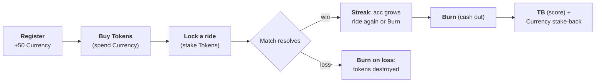
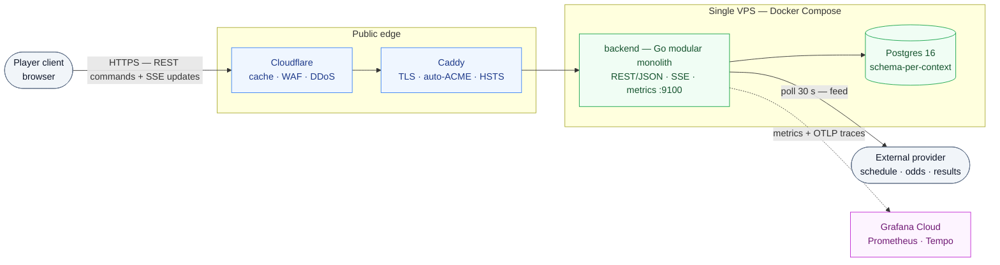

# League Tokens Backend

[](https://go.dev/dl/)
[](#status)
[](#why-a-modular-monolith)

**A game engine for a real-world fantasy-league token game — built as a modular monolith in Go.**

Free-to-play by design: every player starts with a fixed **50-Currency grant** at registration. Currency buys team **Tokens**, which lock into real-world matches, ride winning streaks, and **burn** into **TB** — the only score that matters. Because every Currency/token balance is persistent, tamper-sensitive game state, the backend enforces one hard rule: **a single `ledger` context is the only authority that can change a balance**, and every mutation commits atomically in one Postgres transaction.

> **Terminology:** **Currency** is the game's **in-game currency — NOT fiat, NOT real money.** It has no external value: it is granted at registration and can never be purchased or redeemed. **Tokens** are per-team tokens bought with Currency. **TB** is the only score that matters (Currency is fuel, never victory). **Ledger** is the sole authority over every balance write.

> **Status:** Architecture is fully settled in `docs/` (12 ADRs + system design spec). Code is at early scaffolding — contexts are laid out per ADR-0008, and the engine/ledger/API implementation is being built out. Tracked in [issue #1](https://github.com/Leesale99/league-tokens-backend/issues/1).

## Contents

- [The game in one loop](#the-game-in-one-loop)
- [Why a modular monolith?](#why-a-modular-monolith)
- [Architecture at a glance](#architecture-at-a-glance)
- [Bounded contexts](#bounded-contexts)
- [Repository layout](#repository-layout)
- [Tech stack](#tech-stack)
- [Getting started](#getting-started)
- [CI/CD](#cicd)
- [Documentation map](#documentation-map)
- [Roadmap to 1.0](#roadmap-to-10)
- [Contributing](#contributing)
- [License](#license)

---

## The game in one loop



Two things stay true across every loop: **Currency is fuel** — a closed loop you spend to buy Tokens and recover on a winning burn (stake-back at `base_at_lock × tokens`), never a score. **TB is the only score** — it ranks both the **Player Championship** and the **Team Championship**; Currency never ranks.

---

## Why a modular monolith?

| Approach | Verdict for this product |
|---|---|
| Modular monolith (chosen) | One deployable, one Postgres, atomic balance updates — correct by construction at `[Launch]` scale (10k users), with **deliberate seams** to split into microservices later without a rewrite |
| Microservices day one | Rejected: distributed balance transactions for a demo's scale is pure cost |
| Single flat package | Rejected: no seam to extract contexts; balance integrity gets harder to reason about |

Every bounded context is a Go package that **never imports another context** (ADR-0008). Cross-context calls go through consumer-owned Go interfaces ("ports"); the single composer `cmd/server/main.go` is the only file that knows two contexts at once. The outbox + port seams mean scaling to microservices (ADR-0009) is mostly a `main.go` change, not a domain rewrite.

---

## Architecture at a glance



Full diagrams (system context, monolith internals, end-to-end data flow): [`docs/diagrams/architecture.md`](docs/diagrams/architecture.md).

### Design pillars

1. **One balance authority.** `game` never writes balances — it emits *intent commands* (`LockIntent`, `BurnIntent`, `ReserveBuyIntent`, `GrantCurrencyIntent`) that `ledger` accepts or rejects inside the **same Postgres transaction** (ADR-0002). `rankings` is a pure read-model projection, never a balance.
2. **System vs player tokens.** Two Ed25519 signing keys with distinct audiences: a leaked player token can *never* invoke `ResolveMatch`/`AutoBurnDeadline`/`FinalAutoBurn` (ADR-0004).
3. **Outbox on every mutation.** State change + outbox rows commit atomically; a relay fans events to rankings/SSE/audit with exactly-once delivery — the seam that becomes a message broker at 1.0 (ADR-0009).
4. **Idempotent by design.** `Idempotency-Key` on every mutating command (stored response replay for 24 h); `ResolveMatch` guarded by `UPDATE … WHERE status='Scheduled'` so re-commits are no-ops (ADR-0003).
5. **Fixed-point arithmetic.** `shopspring/decimal` with `NUMERIC(38,6)`, round-half-up, and lint rules that **ban** `.Div/.Floor/.Truncate` outside `internal/infra/dec` (ADR-0010).

---

## Bounded contexts

| Context | Package | Owns |
|---|---|---|
| `identity` | `internal/identity` | users, sessions, signing keys, JWT (Ed25519 ×2, Argon2id) |
| `schedule` | `internal/schedule` | raw feed rows: teams, rounds, matches, results |
| `game` | `internal/game` | engine state machines: Season, Round, Player-season, Ride, `acc`, `Team.base` |
| `ledger` | `internal/ledger` | **sole balance authority**: double-entry journal, wallets, reserve, CommonPool |
| `rankings` | `internal/rankings` | read-model projections: `player_TB`, `team_basket`, boards + tiebreaks |
| `market` | `internal/market` | dormant at Launch — future order book/matching engine |
| `feed` | `internal/feed` | stateless upstream poll adapter (schedule/odds/results provider) |
| `infra` | `internal/infra` | shared kernel: bus/outbox, scheduler, telemetry, dec (fixed-point arithmetic), db (sqlc), config, apperr |

Each context follows the same internal shape: `domain/` (entities, aggregates, invariants) · `application/` (ports + handlers) · `adapter/{postgres,http,outbox}/` (sqlc repos, JSON presenters, event writers).

---

## Repository layout

```
.
├── cmd/server/                 # entry point → the composer (wires contexts, ADR-0008)
├── internal/
│   ├── identity/               # users, sessions, auth (Ed25519 ×2, Argon2id)
│   ├── schedule/               # raw feed rows: teams, rounds, matches, results
│   ├── game/                   # engine: rides, acc, Team.base
│   ├── ledger/                 # sole balance authority: double-entry journal
│   ├── rankings/               # read-model projections (boards, TB)
│   ├── market/                 # dormant at Launch
│   ├── feed/                   # stateless upstream poll adapter
│   ├── http/                   # edge: router, middlewares, SSE broker, problem+json
│   └── infra/                  # shared kernel
│       ├── bus/ scheduler/ telemetry/ db/ dec/ config/ apperr/ events/
│       └── …
├── docs/
│   ├── adr/                    # 0001–0012 — every settled decision
│   ├── specs/                  # system design · game engine · game design · glossary
│   ├── diagrams/               # architecture diagrams
│   └── agents/                 # triage + knowledge-base conventions
├── .github/workflows/          # CI/CD (test, lint, govulncheck, deploy)
├── scripts/issue-workflow/     # agent issue-workflow tooling
├── CONTEXT.md                  # ubiquitous-language glossary + ADR index (read first)
└── compose.env.example         # environment schema (secrets via Docker secrets)
```

---

## Tech stack

- **Go 1.26** — one binary, `cmd/server/main.go` as the only composer
- **Postgres 16** — schema-per-context, one tx per operation, `golang-migrate` embedded migrations
- **sqlc** — generated, parameterized queries only (string-concatenated SQL is lint-banned)
- **REST/JSON + Server-Sent Events** on the public edge; gRPC held internal-only for 1.0
- **Caddy** — TLS (auto-ACME), HSTS, per-IP rate limiting, SSE streaming
- **Cloudflare** free tier — edge cache for hot GETs, WAF, DDoS
- **Grafana Cloud** — Prometheus metrics + Tempo traces (OTLP), `slog` JSON logs
- **Docker Compose** on a VPS — `backend` / `postgres` / `caddy` / backup sidecar; secrets via Docker secrets (ADR-0006)

---

## Getting started

### Prerequisites

- **Go 1.26+**
- **Docker** (for Postgres and the Compose stack)
- **[golangci-lint](https://golangci-lint.run/)** v2.12.2 (the version CI pins)

### Build & run

```bash
# 1. Clone and enter
git clone git@github.com:Leesale99/league-tokens-backend.git && cd league-tokens-backend

# 2. Run tests + lint (what CI runs)
go test ./...
go vet ./...
golangci-lint run          # gosec, govet, errcheck, staticcheck, bodyclose …

# 3. Build
go build -o server ./cmd/server
./server                   # placeholder entry point (scaffolding stage)
```

> The entry point is a scaffolding stub — `cmd/server/main.go` currently prints a
> placeholder. Per ADR-0008 it will become the single **composer** that wires all
> contexts and starts migrations, the scheduler, and the HTTP/SSE edge.

### Local Postgres (when you need one)

```bash
docker run --rm -d -p 127.0.0.1:5432:5432 \
  -e POSTGRES_PASSWORD="$(openssl rand -hex 16)" postgres:16-alpine
```

### Configuration

12-factor, env-driven (`caarlos0/env`); see [`compose.env.example`](compose.env.example) for the full schema. Secrets are read from mounted files at `/run/secrets/*` in Docker — never env vars, never committed (ADR-0012).

---

## CI/CD

GitHub Actions on every PR and push to `main` (`workflows/ci.yml` + `push-main.yml`):

`go build` → `go vet` → `go test ./...` → `golangci-lint` → `govulncheck` → Docker build. Deploy (push to main) SSHes to the VPS and runs `docker compose pull && docker compose up -d --remove-orphans`, health-gated on `/readyz`.

---

## Documentation map

Docs are the source of truth and **always read in this order**:

```
CONTEXT.md                        → ubiquitous-language glossary + ADR index
docs/adr/0001–0012                → every settled decision (boundaries, balances, auth,
                                     edge/SSE, deployment, security, scaling …)
docs/specs/backend_system_design.md → full system design: flows, data model, API reference
docs/specs/game_engine_spec.md     → authoritative engine state machines + formulas (Spec N.M)
docs/specs/game_design.md          → game design intent, tuning levers, phasing
docs/diagrams/architecture.md      → rendered architecture diagrams
```

Rule of thumb: read an ADR before touching its area; only fall through to the big specs when an ADR doesn't answer the question.

---

## Roadmap to 1.0

Staged, traffic-holding checkpoints from ADR-0009:

| Stage | Change | Trigger |
|---|---|---|
| 1 | Read path: edge cache, PG replica, PgBouncer, Redis; extract `rankings` | backend CPU > 65% sustained |
| 2 | Event backbone: NATS JetStream / Kafka replaces in-process outbox relay | outbox lag > 1 s |
| 3 | Extract `ledger` (async commands, keyed by `user_id`) | ledger p99 > 50 ms |
| 4 | Extract `game` (partition by `season_id`, single-writer per season) | game CPU saturates |
| 5 | SSE fan-out via Redis Pub/Sub | SSE per-instance budget crossed |
| 6 | Managed K8s + multi-AZ Postgres, blue/green, managed WAF, IdP | cost beats single VPS |

---

## Contributing

Docs-first: read `CONTEXT.md` → the relevant `docs/adr/` → specs (see [Documentation map](#documentation-map)). Work is tracked as GitHub issues with triage labels (`needs-triage` → `ready-for-agent` / `ready-for-human`); agent conventions live in `docs/agents/`. Commits follow [Conventional Commits](https://www.conventionalcommits.org/).

---

## License

Proprietary — all rights reserved. Contact the repository owner for access terms.
