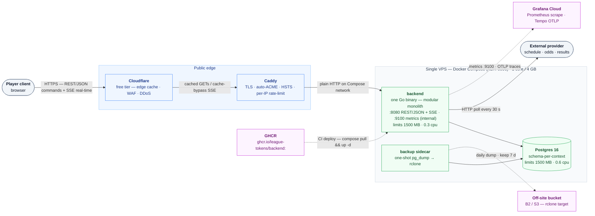
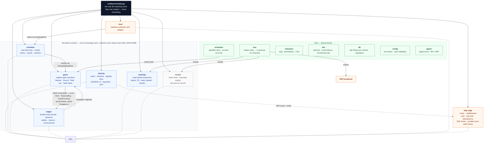
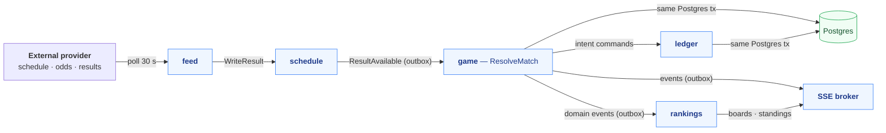

# Architecture Diagrams — League Tokens Backend

Rendered reference of the current `[Launch]` architecture. Source of truth:
`docs/specs/backend_system_design.md` + ADR-0001–0012.

## 1. System context — the edge and the VPS

## 2. Inside the monolith — bounded contexts + shared kernel

## 3. Data flow — one round, end to end

