# League Tokens — Backend System Design

| | |
|---|---|
| **Status** | Living document — the single source of truth for the backend system design |
| **Scope** | `[Launch]` demo and the **1.0** scaling pathway |
| **Implementation** | Go (`go 1.22+` for our internal expectations) |
| **Gameplay authority** | `specs/game_engine_spec.md` (authoritative for engine behaviour) |
| **Architectural method** | Modular Monolith + Domain-Driven Design + Hexagonal (Ports and Adapters) + Clean Architecture principles + Onion-style layered modules + SOLID + software design patterns — explicitly chosen so each module is independently extractable to a microservice (ADR-0009) |
| **Demo target** | VPS: 1 core / 4 GB RAM / 50 GB disk / 4 TB bandwidth; 10k active users (ADR-0006) |
| **1.0 target** | Horizontally scaling backend fleet; multi-AZ managed Postgres; managed broker; managed K8s (ADR-0009) |
| **Companion documents** | Twelve ADRs (`specs/adr/0001`–`0012`) and the glossary (`specs/glossary.md`) |

> **Abstract.** This document synthesizes the backend architecture for the **League
> Tokens** game engine at the `[Launch]` demo and along the **1.0** scaling pathway. It
> *references* twelve ADRs and a glossary rather than repeating them. Where a decision is
> *settled*, an ADR is cited; where it is not settled but *recommended*, this document is
> explicit about the choice.

> [!NOTE]
> **Reading conventions.** References of the form **Spec N.M** point to sections of
> `specs/game_engine_spec.md`. References of the form **Section N.M** point within this
> document. All diagrams are [Mermaid](https://mermaid.js.org) and render directly on
> GitHub; every diagram is accompanied by the authoritative text it summarizes.

## Contents

1. [Overview](#1-overview)
2. [Bounded contexts and module map](#2-bounded-contexts-and-module-map)
3. [Sequence flows](#3-sequence-flows)
4. [Domain model per context](#4-domain-model-per-context)
5. [Ports and adapters](#5-ports-and-adapters)
6. [Data model (Postgres)](#6-data-model-postgres)
7. [Cross-cutting subsystems](#7-cross-cutting-subsystems)
8. [Infrastructure and deployment](#8-infrastructure-and-deployment)
9. [Scaling pathway to 1.0](#9-scaling-pathway-to-10)
10. [Traceability matrix](#10-traceability-matrix)
11. [Non-functional requirements and load model](#11-non-functional-requirements-and-load-model)
- [Appendix A: Per-endpoint API reference](#appendix-a-per-endpoint-api-reference)
- [Appendix B: References](#appendix-b-references)

---

## 1. Overview

The backend is a single Go binary: a **modular monolith** composed of seven bounded
contexts plus a shared kernel. Each context is one Go package; contexts **never** import
one another's packages (ADR-0008). Cross-context collaboration goes through Go interfaces
owned by the consumer ("ports"); concrete adapters live with the producer. The single
composer, `cmd/server/main.go`, is the only file that knows two contexts at once. The
seams are deliberate so a context can be extracted to its own process by re-pointing one
port (ADR-0008, ADR-0002) — nowhere else.

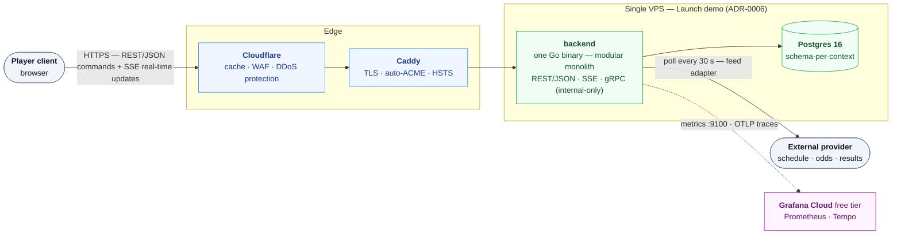

### 1.1 Money flows through one authority

Money is the **only** cross-cutting value with a security invariant (Spec 6.12). All
balance writes flow through the `ledger` context, which is also the **only** money
issuance and movement authority (ADR-0001): other contexts emit *intent commands*
(`LockIntent`, `BurnIntent`, `ReserveBuyIntent`, `GrantCurrencyIntent`) and react to
accepted/rejected events. At Launch, Game↔Ledger calls happen **synchronously inside one
Postgres transaction** (ADR-0002) — there is no network boundary to be asynchronous over,
and there are no win-from-asynchrony gains to chase.

### 1.2 Engine triggers

| Trigger | Kind | Mechanism |
|---|---|---|
| `AutoBurnDeadline` | **Timed** | A Postgres-backed deadline store ticks per-round cutoffs and re-emits events (ADR-0005). Restart-safe, at-most-once. |
| `ResolveMatch` | **Event-driven** | The `feed` adapter polls the upstream schedule/odds/results provider; `schedule` stores raw feed results and emits `ResultAvailable` on the outbox; `game` consumes. |
| `FinalAutoBurn` | **Cascade** | **Not** a separate clock — it runs in the same transaction as `ResolveMatch` for the last match of round R, batched at 1k rides per inner batch so the sweep is restart-resumable. |

### 1.3 Edge protocols

- Real-time player updates are pushed via **Server-Sent Events** over HTTP.
- Player commands are **REST/JSON**. Player mutating commands carry an `Idempotency-Key`
  (ADR-0003).
- **gRPC** is held **internal-only** for the 1.0 service-to-service seam, never exposed to
  the player edge.

### 1.4 Identity and security

Authn is in-house and uses only vetted Go libraries (`golang-jwt`, `crypto/argon2`,
`crypto/ed25519`); authz is the tiny enum `[player | system]` with **two signing keys**
so a leaked player token can never invoke a system-only op (ADR-0004). The whole flow is
hardened under Secure-by-Design (ADR-0007) with Caddy TLS + Cloudflare edge + Docker
secrets + type-checked config + `govulncheck`-gated CI.

### 1.5 How this document is organized

| Sections | Coverage |
|---|---|
| 2–5 | The **inside** of the backend — contexts, flows, domain model, ports & adapters |
| 6–7 | **Storage and cross-cutting infrastructure** |
| 8 | Deployment |
| 9 | The 1.0 scaling pathway |
| 10 | Traceability matrix (this design → Spec 6 invariants) |
| 11 | Non-functional requirements + the load model that justifies the demo box feasibility |
| Appendix A | **Authoritative per-endpoint API table** produced by the grilling session |

---

## 2. Bounded contexts and module map

*Settled by ADR-0001 (bounded contexts) and ADR-0008 (package layout).*

Seven contexts plus a shared kernel; each is one Go internal package.

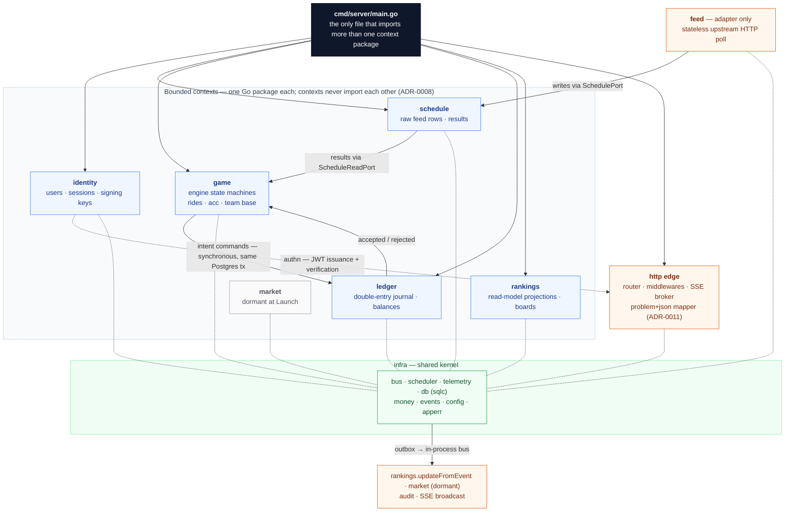

### 2.1 Internal shape of a context

Every context has the same internal layout:

```text
internal/<context>/
├── domain/        entities, value objects, aggregates, invariants, domain errors
├── application/   ports (Go interfaces owned by the consumer) + command/query handlers
└── adapter/
    ├── postgres/  sqlc-generated repository implementations
    ├── http/      JSON presenters + handler bindings to the edge router
    └── outbox/    published event writers
```

Supporting packages:

- `internal/feed/` is an adapter-only package — a stateless upstream polled HTTP
  client writing through the `schedule` port; owns no state.
- `internal/infra/` is the shared kernel: `bus/`, `scheduler/`, `telemetry/`,
  `db/` (one sqlc fileset per context schema), `money/`, `events/` (shared event
  schemas with outbox JSON), `config/`, `apperr/`.
- `internal/http/` is the edge: router, middlewares (auth, rate-limit, idempotency),
  SSE broker, problem+json mapper (ADR-0011), the wire endpoints.
- `migrations/` is one golang-migrate fileset per context schema
  (`migrations/identity/`, `migrations/ledger/`, …).

### 2.2 Module-to-context mapping

Each context lives as `internal/<name>/`:

| Module | Domain owner of | Writes balances | Reads from others |
|---|---|---|---|
| `identity` | users, sessions, signing keys | none | — |
| `schedule` | raw feed rows (teams, rounds, matches, settled odds, results) | none | feed adapter only |
| `game` | engine state machines: Season, Round, Player-season, Ride, `acc`, `Team.base` | none (intent commands to ledger) | `schedule` read port, `ledger` command results |
| `ledger` | double-entry journal, `CommonPool` equity account, `wallet.currency`, `wallet.tokens[*]`, `Team.reserve` | **only owner** | none inside writes |
| `rankings` | read-model projections: `player_TB`, `team_basket`, boards + tiebreaks | none (projection cache = own DB rows) | outbox of `game`+`ledger` |
| `market` | (dormant at `[Launch]`) order book, matching engine, fills | via `ledger` intent only | `ledger`, `game` base price |
| `feed` | none (adapter client only) | none directly; writes through `schedule` port | external upstream HTTP |
| `infra` (kernel) | event bus, scheduler, telemetry, db codegen, `money`, `events`, `config`, `apperr`, `http/` edge | none (it is plumbing) | — |

---

## 3. Sequence flows

### 3.1 System flow: `ResolveMatch` (event-driven trigger)

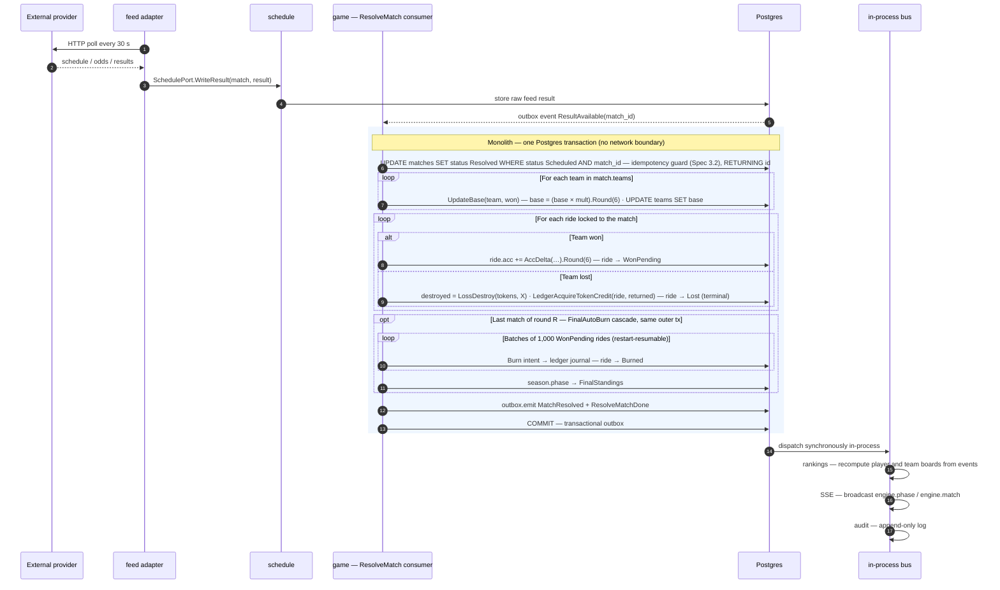

The `FinalAutoBurn` sweep is batched at 1k rides per inner batch inside the same outer
transaction, so the sweep is restart-resumable (Section 1.2).

### 3.2 Player flow: manual `Burn`

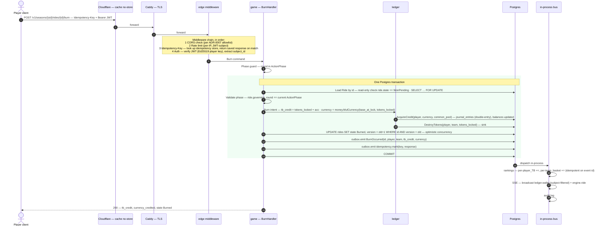

Response (`200`):

```json
{ "tb_credit": "12.500000", "currency_credited": "6.250000", "state": "Burned" }
```

### 3.3 Real-time flow: SSE edge

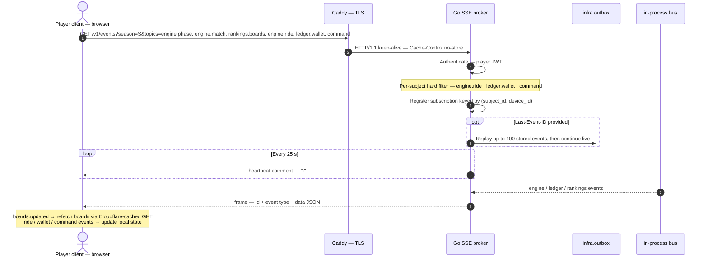

On the wire, each frame is `id:\n event:<type>\n data:{...}\n\n`; responses carry
`Cache-Control: no-store`.

---

## 4. Domain model per context

*Each subsection closes with its Spec 6 enforcement trace; the full matrix is Section 10.*

### 4.1 identity

- **Entities**: `Users { id, email, hashed_password, created_at }`, `RefreshToken {
  id, user_id, device_id, value_hash, family_id, replaced_at, revoked_at }`.
- **Aggregates**: `User` (identity aggregate root); `RefreshToken` (replaced/revoked
  inside the User aggregate transaction to enforce reuse-detection).
- **Invariants** (Spec 6 not directly applicable — auth context): one active session
  per `(user, device)`; refresh rotation revokes the family on reuse. Enforced in the
  `domain` and `application` layers with a Postgres `UNIQUE (user_id, device_id)` partial
  index on active sessions.

### 4.2 schedule

- **Entities**: `Teams { id, name, metadata }`, `Rounds { id, season_id, round_no,
  scheduled_first_tipoff, phase }`, `Matches { id, season_id, round_no, home_team_id,
  away_team_id, scheduled_tip_off, settled_odds, status }`.
- **Aggregates**: stored as raw feed rows keyed by upstream ids; `schedule` itself
  owns no business logic except feed-dedup (per `(match_id, provider, payload_hash)`).
- **Spec 6 enforcement**: Spec 3.2 idempotency on `match_id` *consumes* a
  `ResultAvailable` event from `schedule`. `schedule` never overlays; `game`'s
  `ResolveMatch` ensures the `UPDATE matches SET status='Resolved' WHERE
  status='Scheduled'` guard.

### 4.3 game (engine)

**Aggregates and their state machines:**

`Season` (Spec 2.1) — all terminal states are append-only; no rollback at `[Launch]`:

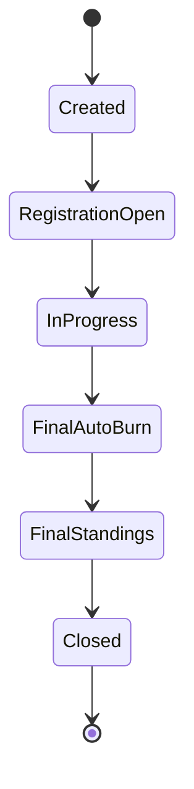

`Round` (Spec 2.2) — cutoff timestamp `scheduled_first_tipoff(round) − 1h` is
engine-owned, not player-settable:

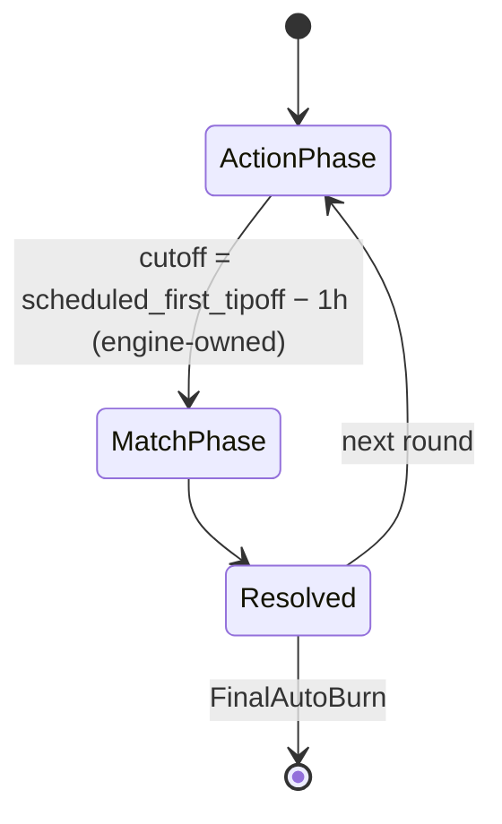

`Match` (Spec 2.3) — `InPlay` has no engine effect except cutoff already passed:

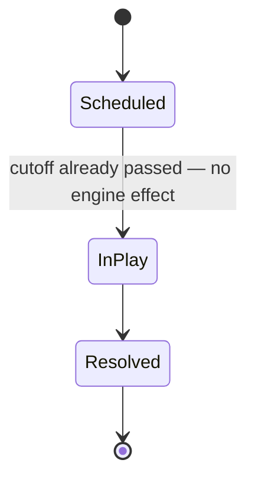

`Player-season { subject_id, season_id, favourite_team_id, registered_at }` — one-shot
per season.

`Ride` — the heart of the engine per Spec 7. `tokens_locked` and `base_at_lock` are set
at first `Locked` and are ride-lifetime immutable; `streak`, `acc`, `match` are mutable
through the `Ride` op and `ResolveMatch`:

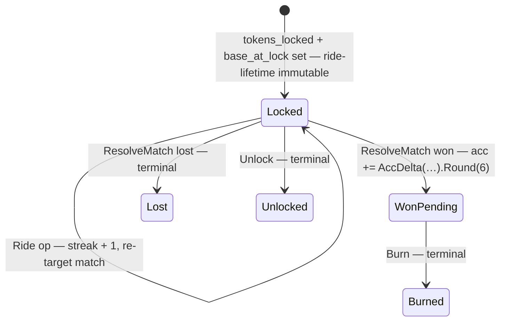

**Spec 6 enforcement — invariants:**

| Spec invariant | Enforcement in `game` |
|---|---|
| 6.1 — Phase guard | `Lock/Ride/Burn/Unlock` handlers reject if `governing_round.phase != ActionPhase` (returns `game.phase_closed` 409 per ADR-0011). `BuyFromReserve` skips this guard per Spec 6.1. |
| 6.4 — Lock target | handler rejects `game.no_scheduled_match` if `Match WHERE round_no=current.action_phase_round AND (home=? OR away=?)` returns no `Scheduled` row. |
| 6.5 — Ride state gate | application layer checks `Ride.state` per op; any invalid transition raises `game.invalid_state_transition` 409. |
| 6.6 — Auto-burn exclusivity | handlers built on the public port accept only `player` tokens; `system`-only methods (`ResolveMatch`, `AutoBurnDeadline`, `FinalAutoBurn`) are exposed on a separate **system** port mounted only on localhost — never via the public `/v1` tree. Caddy adds an IP allow-list blocklisting the system-port path. |
| 6.8 — Favourite immutability | `Player-season` instantiated once per `(subject_id, season_id)`. Postgres `CHECK (favourite_team_id IS NOT NULL)` + a `BEFORE UPDATE` trigger `RAISE EXCEPTION` on any update of `favourite_team_id`. |
| 6.9 — Result append-only | `UPDATE matches SET status='Resolved' WHERE status='Scheduled' AND match_id=?` statement. 0 rows affected returns `game.already_resolved` 409. |
| 6.11 — Terminal states | Postgres partial CHECK that blocks any UPDATE on rows in `Lost/Burned/Unlocked` unless `version` increments AND the next state is itself terminal; otherwise `game.invalid_state_transition`. |
| 6.12 — Precision | outsourced to `internal/infra/money` (ADR-0010). |

### 4.4 ledger

- **Aggregates** (accounting-core): each `(player_id, team_id)` is a **token account**;
  one **currency account** per player; one `CommonPool` equity account; one
  `TreasuryEquity` account absorbing the Spec 6.10 mechanical-mint guarantee. Balances
  are a *projection*; the append-only `journal_entries` table is the source of truth.
- **Intent commands** (the *only* entry points for money writes):

| Intent command | Journal effect |
|---|---|
| `ReserveBuyIntent { player, team, tokens }` | debits `player.currency` by `(base × tokens).Round(6)`, credits `CommonPool`, debits `Team.reserve`, credits `player.tokens[team]` by `tokens` |
| `LockIntent { player, team, tokens }` | debits `player.tokens[team]` by `tokens`, credits the ride-held token account by `tokens` (held on `Ride` aggregate) |
| `BurnIntent { player, team, tokens, base_at_lock, acc_realised }` | debits ride-held tokens, destroys them (sink); credits `player.currency` by `(base_at_lock × tokens).Round(6)` debiting `CommonPool`; if `CommonPool` is at 0, per Spec 6.10 it goes negative and observability alerts (`TreasuryEquity` absorbs in the books), but the journal rejects rewrite — ADR-0001 |
| `LossReturnIntent { player, team, returned_tokens }` | debits ride-held tokens; credits `player.tokens[team]` by `returned`; destroys `destroyed = (tokens × X).Round(6)` (sink) |
| `GrantCurrencyIntent { player, amount }` | credits `player.currency`, debits `CommonPool` (Register grant, Spec 3) |

- **Spec 6 enforcement**: Spec 6.2 sufficient wallet (currency/tokens), Spec 6.3
  reserve, Spec 6.7 non-negative balances, Spec 6.10 mechanical-mint safety — all
  ledger-side guards. A check rejects if a `Sub` would push below zero (no silent
  clamp), returning `ledger.insufficient_balance` (402).
- **Idempotency**: every intent command is identified by `(subject_id, idempotency_key)`
  from the player command (ADR-0003) — same transaction guarantees dedup.

### 4.5 rankings

- **Read models**: `player_TB { season_id, subject_id, total_tb }`,
  `team_basket { season_id, team_id, basket }`, `team_contributor { season_id,
  team_id, subject_id, contributed_tb }`. Boards query above rows with the MVP tiebreak
  (`TB desc, then oldest account (player board) / team_id (team board)` per Spec 8).
- **Invariants**: projection is idempotent on `(event_id, table)`; admin-triggered
  replay from the journal rebuilds the projection safely (cache-aside pattern).

### 4.6 market (dormant)

- At `[Launch]`: empty package + port (`internal/market/application/ports.go`) exposing
  `PlaceOrderPort`, `MatchOrderPort`, `TradeFillPort` so the `[Market]` addendum slots in.
- The `[Market]` adapter persists order book entries and reads `Team.base` and
  `Team.reserve` via ports into `game` and `ledger`.

### 4.7 feed

- Stateless Go HTTP client wrapping the upstream provider. Pulls every 30s with
  exponential backoff on errors. Calls `SchedulePort` write methods;
  idempotent per `(match_id, provider, payload_hash)`.

---

## 5. Ports and adapters

*Hexagonal map: ports are Go interfaces defined in the **consumer's** package; concrete
adapters live with the producer.*

| Context | Ports it **owns** (defines Go interfaces in consumer's pkg) | Concrete adapters implementing those ports |
|---|---|---|
| `identity` | `UserRepo`, `RefreshTokenRepo`, `KeyRing` (Ed25519 player+system keys) | `postgres.UserRepo`, `postgres.RefreshTokenRepo`, `apperrfile.KeyRing` (Docker secrets) |
| `schedule` | `TeamRepo`, `RoundRepo`, `MatchRepo`, `FeedWriter` (the port `feed` calls) | `postgres.FeedWriter`, `ScheduleHTTPPort` |
| `game` | `GameStateRepo` (Season, Round, Ride snapshots + ride_events appender), `RideRepo`, `TeamBaseRepo`, `SchedulerPort` (cutoffs), `LedgerPort` (intent commands), `ScheduleReadPort` (results), `BusPort` (event publisher) | `postgres.*Repo`, `infra.scheduler` implementing `SchedulerPort`, `internal/ledger/adapter/gameclient` implementing `LedgerPort`, `internal/schedule/adapter/gamereader` implementing `ScheduleReadPort` |
| `ledger` | `JournalRepo`, `BalanceRepo`, `RideHoldingRepo`, `BusPort` | `postgres.JournalRepo`, `postgres.BalanceRepo` |
| `rankings` | `BurnEventSource` (subscription), `ProjectionRepo`, `BusPort` | `internal/bus.RankingsSubscription` implementing `BurnEventSource`, `postgres.ProjectionRepo` |
| `market` | (ports reserved, dormant) | — |
| `feed` | `ProviderClient` (upstream HTTP), `ScheduleWriter` (calls schedule port) | `httptime.ProviderClient`, dispatch via `schedule.application.FeedWriter` |
| `infra` (kernel) | none (it implements others' ports) | n/a |

Cross-context call examples:

- `game.application.BurnIssue` accepts the consumer-defined
  `LedgerPort interface { LockIntent(...); BurnIntent(...) ... }`.
- `cmd/server/main.go` constructs `ledger.adapter.gameclient.Ledger{}` and passes it to
  the `game` application service.
- Single source-of-truth rules (ADR-0008) forbid `game/application` from importing
  `internal/ledger`.

---

## 6. Data model (Postgres)

Schema-per-context, enforced by `sqlc` schema boundaries. All money columns are
`NUMERIC(38,6)` (or `NUMERIC(8,6)` for `money.Odds`), per ADR-0010. Schema shapes below
skip the enum constraints and audit columns for brevity; full SQL lives in
`migrations/<context>/`.

> [!NOTE]
> The ER sketches simplify type names (for example `numeric`); the DDL under each
> subsection is authoritative.

**Engine schemas** — `schedule` + `game`:

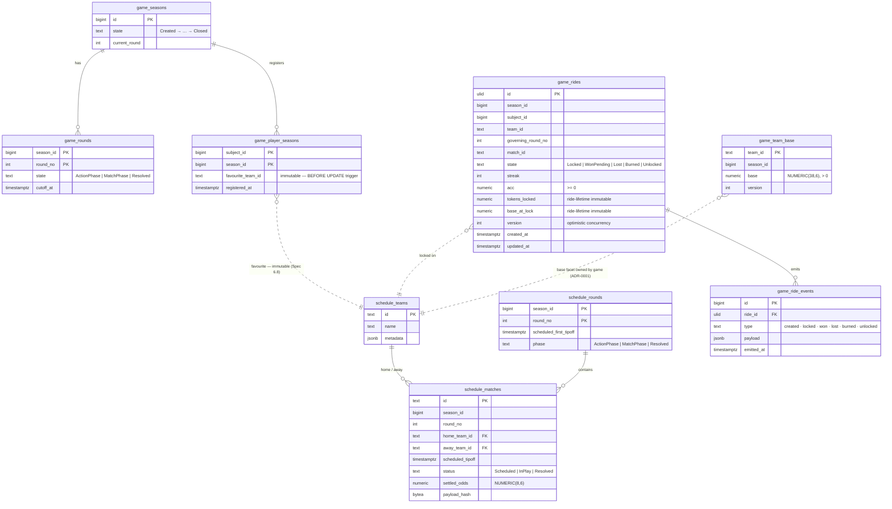

**Money and projection schemas** — `ledger` + `rankings` + `infra`:

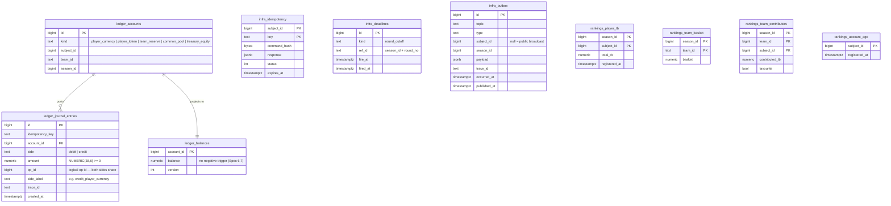

### 6.1 `identity` schema

```sql
CREATE SCHEMA identity;
CREATE TABLE identity.users (
  id BIGINT GENERATED ALWAYS AS IDENTITY PRIMARY KEY,
  email TEXT NOT NULL UNIQUE,
  password_hash TEXT NOT NULL,                  -- argon2id
  created_at TIMESTAMPTZ NOT NULL DEFAULT now()
);
CREATE TABLE identity.refresh_tokens (
  id BIGINT GENERATED ALWAYS AS IDENTITY PRIMARY KEY,
  user_id BIGINT NOT NULL REFERENCES identity.users(id),
  device_id TEXT NOT NULL,
  value_hash BYTEA NOT NULL,                     -- sha256 of token
  family_id BIGINT NOT NULL,
  issued_at TIMESTAMPTZ NOT NULL DEFAULT now(),
  replaced_at TIMESTAMPTZ,
  revoked_at TIMESTAMPTZ,
  UNIQUE (user_id, device_id)  -- partial: enforced only for active (revoked_at IS NULL)
);
```

### 6.2 `schedule` schema

```sql
CREATE SCHEMA schedule;
CREATE TABLE schedule.teams (
  id TEXT PRIMARY KEY,
  name TEXT NOT NULL,
  metadata JSONB NOT NULL DEFAULT '{}'::jsonb
);
CREATE TABLE schedule.rounds (
  season_id BIGINT NOT NULL,
  round_no INT NOT NULL,
  scheduled_first_tipoff TIMESTAMPTZ NOT NULL,
  phase TEXT NOT NULL CHECK (phase IN ('ActionPhase','MatchPhase','Resolved')),
  PRIMARY KEY (season_id, round_no)
);
CREATE TABLE schedule.matches (
  id TEXT PRIMARY KEY,
  season_id BIGINT NOT NULL,
  round_no INT NOT NULL,
  home_team_id TEXT NOT NULL REFERENCES schedule.teams(id),
  away_team_id TEXT NOT NULL REFERENCES schedule.teams(id),
  scheduled_tipoff TIMESTAMPTZ NOT NULL,
  status TEXT NOT NULL CHECK (status IN ('Scheduled','InPlay','Resolved')),
  settled_odds NUMERIC(8,6) NOT NULL,
  payload_hash BYTEA
);
CREATE UNIQUE INDEX unique_match_result ON schedule.matches (id, payload_hash);
```

### 6.3 `game` schema — engine state machines

```sql
CREATE SCHEMA game;
CREATE TABLE game.seasons (
  id BIGINT PRIMARY KEY,
  state TEXT NOT NULL CHECK (state IN
    ('Created','RegistrationOpen','InProgress','FinalAutoBurn','FinalStandings','Closed')),
  current_round INT
);
CREATE TABLE game.rounds (
  season_id BIGINT NOT NULL,
  round_no INT NOT NULL,
  state TEXT NOT NULL CHECK (state IN ('ActionPhase','MatchPhase','Resolved')),
  cutoff_at TIMESTAMPTZ NOT NULL,
  PRIMARY KEY (season_id, round_no)
);
CREATE TABLE game.player_seasons (
  subject_id BIGINT NOT NULL,
  season_id BIGINT NOT NULL,
  favourite_team_id TEXT NOT NULL,
  registered_at TIMESTAMPTZ NOT NULL DEFAULT now(),
  PRIMARY KEY (subject_id, season_id)
);
-- favourite_team_id immutability, Spec 6.8:
CREATE OR REPLACE FUNCTION game.lock_favourite()
RETURNS TRIGGER LANGUAGE plpgsql AS $$
BEGIN
  IF NEW.favourite_team_id IS DISTINCT FROM OLD.favourite_team_id THEN
    RAISE EXCEPTION 'favourite_team_id is immutable (Spec 6.8)'
      USING ERRCODE = 'check_violation';
  END IF;
  RETURN NEW;
END $$;
CREATE TRIGGER u_pa_fav BEFORE UPDATE ON game.player_seasons
FOR EACH ROW EXECUTE FUNCTION game.lock_favourite();

CREATE TABLE game.team_base (        -- Team.base facet owned by game (ADR-0001)
  team_id TEXT PRIMARY KEY,
  season_id BIGINT NOT NULL,
  base NUMERIC(38,6) NOT NULL CHECK (base > 0),
  version INT NOT NULL DEFAULT 1
);

CREATE TABLE game.rides (
  id ULID PRIMARY KEY,
  season_id BIGINT NOT NULL,
  subject_id BIGINT NOT NULL,
  team_id TEXT NOT NULL,
  governing_round_no INT NOT NULL,
  match_id TEXT,
  state TEXT NOT NULL CHECK (state IN
    ('Locked','WonPending','Lost','Burned','Unlocked')),
  streak INT NOT NULL DEFAULT 0,
  acc NUMERIC(38,6) NOT NULL DEFAULT 0 CHECK (acc >= 0),
  tokens_locked NUMERIC(38,6) NOT NULL,  -- ride-lifetime immutable
  base_at_lock NUMERIC(38,6) NOT NULL,   -- ride-lifetime immutable
  version INT NOT NULL DEFAULT 1,
  created_at TIMESTAMPTZ NOT NULL DEFAULT now(),
  updated_at TIMESTAMPTZ NOT NULL DEFAULT now()
);
-- Spec 6.11 terminal-state protection
CREATE OR REPLACE FUNCTION game.block_terminal_mutations()
RETURNS TRIGGER LANGUAGE plpgsql AS $$
BEGIN
  IF OLD.state IN ('Lost','Burned','Unlocked')
     AND NEW.state IS NOT DISTINCT FROM OLD.state THEN
    RAISE EXCEPTION 'terminal ride state % cannot be mutated (Spec 6.11)', OLD.state
      USING ERRCODE = 'check_violation';
  END IF;
  RETURN NEW;
END $$;
CREATE TRIGGER u_r_terminal BEFORE UPDATE ON game.rides
FOR EACH ROW EXECUTE FUNCTION game.block_terminal_mutations();

CREATE TABLE game.ride_events (
  id BIGINT GENERATED ALWAYS AS IDENTITY PRIMARY KEY,
  ride_id ULID NOT NULL REFERENCES game.rides(id),
  type TEXT NOT NULL,                           -- created, locked, won, lost, burned, unlocked
  payload JSONB NOT NULL,
  emitted_at TIMESTAMPTZ NOT NULL DEFAULT now()
);
```

### 6.4 `ledger` schema — double-entry journal

```sql
CREATE SCHEMA ledger;
CREATE TABLE ledger.accounts (
  id BIGINT GENERATED ALWAYS AS IDENTITY PRIMARY KEY,
  -- Composite discriminator: player-currency, player-token, team-reserve,
  -- common-pool equity, treasury-equity.
  kind TEXT NOT NULL CHECK (kind IN
    ('player_currency','player_token','team_reserve','common_pool','treasury_equity')),
  subject_id BIGINT,
  team_id TEXT,
  season_id BIGINT NOT NULL,
  UNIQUE (kind, subject_id, team_id, season_id)
);
CREATE TABLE ledger.journal_entries (
  id BIGINT GENERATED ALWAYS AS IDENTITY PRIMARY KEY,
  idempotency_key TEXT NOT NULL,
  account_id BIGINT NOT NULL REFERENCES ledger.accounts(id),
  side TEXT NOT NULL CHECK (side IN ('debit','credit')),
  amount NUMERIC(38,6) NOT NULL CHECK (amount >= 0),
  op_id BIGINT NOT NULL,            -- logical op id; both sides share; per idempotency table
  side_label TEXT NOT NULL,         -- e.g. "credit_player_currency"
  trace_id TEXT,
  created_at TIMESTAMPTZ NOT NULL DEFAULT now()
);
CREATE UNIQUE INDEX one_journal_entry_per_idem ON ledger.journal_entries (op_id, account_id, side);
CREATE TABLE ledger.balances (
  account_id BIGINT PRIMARY KEY REFERENCES ledger.accounts(id),
  balance NUMERIC(38,6) NOT NULL,
  version INT NOT NULL DEFAULT 1
);
-- Money invariants: non-negative balances for player_currency / player_token / team_reserve
CREATE OR REPLACE FUNCTION ledger.no_negative()
RETURNS TRIGGER LANGUAGE plpgsql AS $$
BEGIN
  IF NEW.balance < 0
     AND EXISTS (SELECT 1 FROM ledger.accounts a
                 WHERE a.id = NEW.account_id
                   AND a.kind IN ('player_currency','player_token','team_reserve')) THEN
    RAISE EXCEPTION 'balance cannot go negative (Spec 6.7)'
      USING ERRCODE = 'check_violation';
  END IF;
  RETURN NEW;
END $$;
CREATE TRIGGER u_b_neg BEFORE UPDATE ON ledger.balances
FOR EACH ROW EXECUTE FUNCTION ledger.no_negative();

CREATE SCHEMA infra;   -- ids shared between contexts
CREATE TABLE infra.idempotency (
  subject_id BIGINT NOT NULL,
  key TEXT NOT NULL,
  command_hash BYTEA NOT NULL,
  response JSONB,
  status INT,
  expires_at TIMESTAMPTZ NOT NULL,
  PRIMARY KEY (subject_id, key)
);
```

### 6.5 `rankings` schema

```sql
CREATE SCHEMA rankings;
CREATE TABLE rankings.player_tb (
  season_id BIGINT NOT NULL,
  subject_id BIGINT NOT NULL,
  total_tb NUMERIC(38,6) NOT NULL DEFAULT 0,
  registered_at TIMESTAMPTZ NOT NULL,
  PRIMARY KEY (season_id, subject_id)
);
CREATE TABLE rankings.team_basket (
  season_id BIGINT NOT NULL,
  team_id TEXT NOT NULL,
  basket NUMERIC(38,6) NOT NULL DEFAULT 0,
  PRIMARY KEY (season_id, team_id)
);
CREATE TABLE rankings.team_contributors (
  season_id BIGINT NOT NULL,
  team_id TEXT NOT NULL,
  subject_id BIGINT NOT NULL,
  contributed_tb NUMERIC(38,6) NOT NULL DEFAULT 0,
  favourite BOOLEAN NOT NULL,
  PRIMARY KEY (season_id, team_id, subject_id)
);
CREATE TABLE rankings.account_age (     -- precomputed tiebreak input (Spec 8 MVP)
  subject_id BIGINT PRIMARY KEY,
  registered_at TIMESTAMPTZ NOT NULL
);

CREATE SCHEMA infra2; -- placeholder (see infra.bus & scheduler below)
```

### 6.6 scheduler & outbox (infra)

```sql
CREATE SCHEMA infra;
CREATE TABLE infra.deadlines (
  id BIGINT GENERATED ALWAYS AS IDENTITY PRIMARY KEY,
  kind TEXT NOT NULL CHECK (kind IN ('round_cutoff')),
  ref_id TEXT NOT NULL,             -- season_id+","+round_no
  fire_at TIMESTAMPTZ NOT NULL,
  fired_at TIMESTAMPTZ,
  created_at TIMESTAMPTZ NOT NULL DEFAULT now()
);
CREATE INDEX unfired ON infra.deadlines (fire_at) WHERE fired_at IS NULL;

CREATE TABLE infra.outbox (
  id BIGINT GENERATED ALWAYS AS IDENTITY PRIMARY KEY,
  topic TEXT NOT NULL,
  type TEXT NOT NULL,
  subject_id BIGINT,                -- null for public broadcasts
  season_id BIGINT,
  payload JSONB NOT NULL,
  trace_id TEXT,
  occurred_at TIMESTAMPTZ NOT NULL DEFAULT now(),
  published_at TIMESTAMPTZ
);
CREATE INDEX unpublished ON infra.outbox (occurred_at) WHERE published_at IS NULL;
```

---

## 7. Cross-cutting subsystems

### 7.1 Outbox relay

*Settled by ADR-0002 (persistence and consistency) and ADR-0003 (API edge, SSE,
idempotency).*

Every mutating op writes its outbox events inside the same Postgres transaction that
committed the state change. A single background goroutine per logical topic, or a
single dispatcher with a fan-out, polls the outbox table
(`WHERE published_at IS NULL ORDER BY id LIMIT N FOR UPDATE SKIP LOCKED`,
locks `SKIP LOCKED` for parallelism), publishes to in-process subscribers via
Go channels, and marks rows `published_at = now()` once delivered.

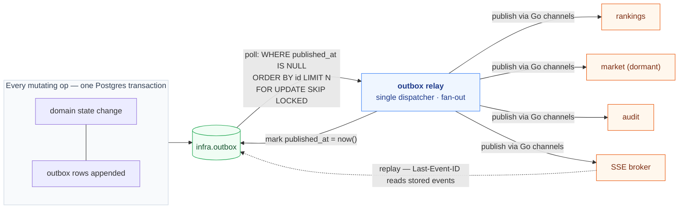

- **Exactly-once downstream**: every consumer stores the highest seen `infra.outbox.id`
  per `(topic)` and skips older ones on restart.
- **Replay**: `Last-Event-ID` on SSE (per ADR-0003 / Section 3.3) consumes the same
  outbox table; reads up to N stored events newer than the supplied id.
- **Transport seam** (ADR-0009 Stage 2): the publisher is a single Go interface, swapped
  in `main.go` from `infra.bus.InProcess` to `infra.bus.NATSJetStream` (or `Kafka`)
  when the 1.0 split lands.

### 7.2 Scheduler

*Settled by ADR-0005 (system triggers, scheduler, feed).*

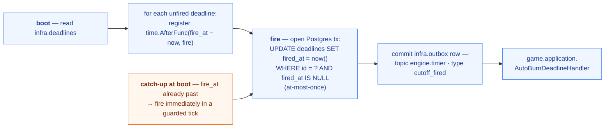

- `infra.scheduler` reads `infra.deadlines` on boot; for each unfired deadline, it
  registers `time.AfterFunc(fire_at - now, fire)`. `fire` opens a Postgres tx,
  runs `UPDATE deadlines SET fired_at = now() WHERE id = ? AND fired_at IS NULL`
  (at-most-once), and commits an `infra.outbox` row (`topic = engine.timer`,
  `type = cutoff_fired`) for `game.application.AutoBurnDeadlineHandler`.
- `schedule` writes catch up the deadline row every time `migrations`' `rounds` table
  receives cutoff updates (a `Postgres LISTEN/NOTIFY` channel can also trigger for
  low-frequency feed updates at Launch).
- "Catch-up" at boot: a deadline whose `fire_at` is already past is fired **immediately**
  in a guarded tick, so missed cutoffs are made up at most once on restart.

### 7.3 Telemetry

*Settled by ADR-0006 (deployment and observability).*

- **Logs**: `internal/infra/telemetry/log` wraps `slog` with JSON handler in
  production. Logs include correlating fields: `code` (ADR-0011), `op`, `subject_id`,
  `trace_id`, `request_id`.
- **Metrics**: `prometheus/client_golang` registry; counters per context (`ops_total`
  with label op & error-code), histograms (`ops_duration_seconds`), plus the existing
  `journal_entries_appended_total`, `deadlines_fired_total`, `outbox_lag_seconds`,
  `outbox_lag_count`, `sse_active_connections_gauge`, `swept_rides_total`. Exposed at
  `:9100/metrics` on an internal-only Compose `expose:`, scraped from Grafana Cloud's
  Prometheus free tier.
- **Traces**: `otel` SDK with `parentbased(trace_id_ratio=0.1)` sampling; OTLP/gRPC
  exporter to Grafana Cloud Tempo free tier. Error spans are always sampled.
- **Health**: `/healthz` for liveness (process alive). `/readyz` for readiness (DB
  ping, scheduler alive, outbox drain liveness). Used by Compose `healthcheck` and
  Caddy upstream probe.

### 7.4 Money

*Settled by ADR-0010 (decimal + round-half-up).*

- `internal/infra/money` re-exports `Amount`, `Tokens`, `Odds` aliases over
  `decimal.Decimal` from `github.com/shopspring/decimal`.
- `decimal.DivisionPrecision = 6` globally; the helper applies `.Round(6)` (half-up)
  at every persisted arithmetic step (`MulByDecimal`, `MulCurrency`, `UpdateBase`,
  `AccDelta`, `LossDestroy`).
- A `depguard`+`ruleguard` lint rule bans `.Div/.Floor/.Truncate/.RoundUp/.RoundDown`
  everywhere and bans `.Round(...)` outside the `internal/infra/money` package.
- Storage: `NUMERIC(38,6)` (or `NUMERIC(8,6)` for odds).
- Custom `MarshalJSON` produces the fixed six-decimal string `"50.000000"`.

### 7.5 Type-checked errors

*Settled by ADR-0011 (typed error model).*

- `internal/infra/apperr.Error` carries stable `Code`, `Msg`, `HTTPStatus`, `Fields`,
  `Cause`. Sentinel errors per context (`errors.Is`/`errors.As` work); the HTTP layer
  renders `application/problem+json` (RFC 7807). Idempotency-key collisions return
  `infra.idempotency_conflict` 409; `AlreadyResolved` returns `game.already_resolved`
  409. See `specs/adr/0011-error-model.md` for the canonical code table.

### 7.6 Security posture

*Settled by ADR-0007 (security posture) and ADR-0004 (identity and auth).*

- **Authn** (ADR-0004) — Ed25519 tokens × 2, Argon2id, refresh rotation with reuse-
  detection; `system` vs `player` separation; system-port endpoints never reachable
  from the player edge.
- **TLS** — Caddy auto-ACME, HSTS 1y + preload, HTTP→HTTPS redirect.
- **Reverse proxy** — Cloudflare in front of Caddy, caching read-only public GETs;
  SSE bypassing Cloudflare cache verified pre-launch.
- Headers, CORS allowlist, CSRF, rate-limits, input validation, SQL via sqlc
  (parameterized, no string concat), secrets via Docker secrets, `govulncheck` in CI,
  Renovate bot, PII minimisation, audit logging — all per ADR-0007.
- **Spec-specific enforcement**: Spec 3.2 `AlreadyResolved` (UPDATE guard); Spec 6.6
  system-only protected via a separate port + IP ACL; Spec 6.8 favourite immutability
  Postgres trigger; Spec 6.9 result append-only Postgres UPDATE-WHERE guard; Spec 6.11
  terminal-state Postgres trigger; Spec 6.12 fixed-point precision enforced at code +
  storage + test + lint (ADR-0010).

### 7.7 Configuration

*Settled by ADR-0012 (configuration management).*

- 12-factor env-driven config via `github.com/caarlos0/env/v11`; secrets loaded from
  Docker secrets at `/run/secrets/*`. Context-typed `Config` structs with strict
  `Validate()` running in `cmd/server/main.go` before any subsystem starts; an invalid
  config is a `log.Fatal` (the **only** permitted panic-equivalent). No hot reload at
  Launch; restart to update. No `.env` in repo; `compose.env.example` documents the
  schema only.

---

## 8. Infrastructure and deployment

*Settled by ADR-0006 (deployment and observability).*

### 8.1 Deployment topology and Compose stack

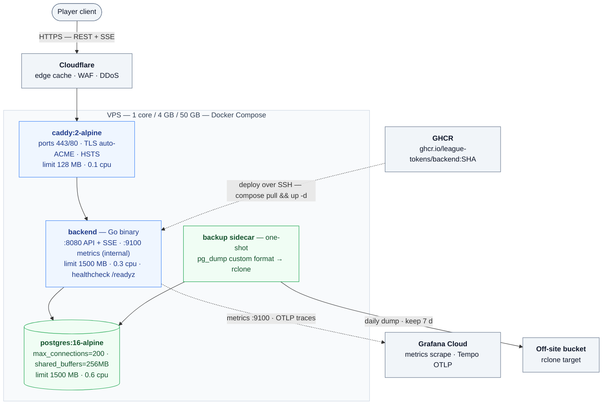

```yaml
services:
  caddy:
    image: caddy:2-alpine
    ports: ['443:443','80:80']
    volumes: ['./Caddyfile:/etc/caddy/Caddyfile:ro','caddy_data:/data','caddy_config:/config']
    depends_on: { backend: { condition: service_healthy } }
    deploy: { resources: { limits: { memory: 128m, cpus: '0.1' } } }
  backend:
    image: ghcr.io/league-tokens/backend:${TAG:-latest}
    env_file: ./compose.env
    secrets: [db_password, ed25519_player_key, ed25519_system_key,
              provider_api_key, otlp_token, grafana_cloud_token]
    depends_on: { postgres: { condition: service_healthy } }
    stop_grace_period: 30s
    deploy: { resources: { limits: { memory: 1500m, cpus: '0.3' } } }
    healthcheck: { test: ['CMD','wget','-qO','/dev/null','http://localhost:8080/readyz'],
                   interval: 15s, timeout: 3s, retries: 5 }
  postgres:
    image: postgres:16-alpine
    environment:
      POSTGRES_USER: league
      POSTGRES_DB: league
      POSTGRES_PASSWORD_FILE: /run/secrets/db_password
    volumes: ['pg_data:/var/lib/postgresql/data']
    secrets: [db_password]
    command: ['postgres','-c','max_connections=200','-c','shared_buffers=256MB']
    deploy: { resources: { limits: { memory: 1500m, cpus: '0.6' } } }
    healthcheck: { test: ['CMD','pg_isready'], interval: 10s, timeout: 3s, retries: 10 }
volumes:
  caddy_data: {}
  caddy_config: {}
  pg_data: {}
secrets:
  db_password:        { file: /etc/league-tokens/secrets/db_password }
  ed25519_player_key: { file: /etc/league-tokens/secrets/ed25519_player_key }
  ed25519_system_key: { file: /etc/league-tokens/secrets/ed25519_system_key }
  provider_api_key:   { file: /etc/league-tokens/secrets/provider_api_key }
  otlp_token:         { file: /etc/league-tokens/secrets/otlp_token }
  grafana_cloud_token:{ file: /etc/league-tokens/secrets/grafana_cloud_token }
```

### 8.2 Caddyfile sketch (HTTPS auto, Cloudflare upstream)

```text
{
  email ops@league-tokens.example
  admin off
}
api.league-tokens.example {
  reverse_proxy backend:8080 {
    header_up X-Real-IP {remote_host}
    flush_interval -1                # SSE streaming
  }
  header {
    Strict-Transport-Security "max-age=31536000; preload"
    X-Content-Type-Options nosniff
    Referrer-Policy no-referrer
    Permissions-Policy "geolocation=(), microphone=(), camera=()"
    Cache-Control "no-store"     # default; overridden for cached public GETs
  }
}
internal.metrics.league-tokens.example {
  bind 127.0.0.1                # /metrics, localhost only
  reverse_proxy backend:9100
}
```

### 8.3 Build and CI/CD

GitHub Actions pipeline:

```yaml
on: push to main
jobs:
  ci:
    runs-on: ubuntu-22.04
    steps:
      - uses: actions/setup-go@v5
        with: { go-version: '1.22' }
      - uses: actions/checkout@v4
      - run: go test ./...
      - run: go vet ./...
      - uses: golangci/golangci-lint-action@v6
      - run: go run github.com/golang/vulncheck/cmd/govulncheck@latest ./...
      - run: docker build -t ghcr.io/league-tokens/backend:${{ github.sha }} .
      - run: docker push ghcr.io/league-tokens/backend:${{ github.sha }}
  deploy:
    needs: ci
    runs-on: ubuntu-22.04
    steps:
      - uses: appleboy/ssh-action@...
        with:
          script: |
            cd /opt/league-tokens
            export TAG=${{ github.sha }}
            docker compose pull
            docker compose up -d --remove-orphans
            for i in 1..60; do curl -fsS http://localhost/readyz && break; sleep 1; done
```

### 8.4 Backups

Daily backup sidecar (one-shot Compose run):

```bash
docker compose run --rm pg_dump \
  pg_dump --format=custom \
  --file=/backup/league_$(date +%F).dump
rclone copy /backup rclone:bucket/league-tokens/backups/ --include '*.dump' \
  --transfers 4 --delete-after 7d
```

---

## 9. Scaling pathway to 1.0

*Settled by ADR-0009 (scaling strategy). Six staged checkpoints; each holds traffic.
Triggers are based on telemetry thresholds.*

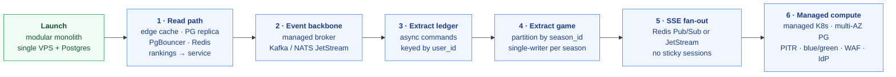

| Stage | What changes | Trigger condition | Engine impact |
|---|---|---|---|
| 1. Read path | Cloudflare edge cache for boards; PG read replica + PgBouncer; Redis cache-aside; extract `rankings` to its own stateless service | backend CPU sustained > 65% over 5 min; DB read latency p99 > 50 ms | none |
| 2. Event backbone | outbox relay publishes to managed broker (Kafka / NATS JetStream); downstream consumers wire-subscribe | outbox lag > 1 s sustained; 2nd downstream context needed | none — transport swap |
| 3. Extract `ledger` | ledger Postgres on its own instance; ADR-0002 sync seam flips to async commands over the backbone (keyed by `user_id`) | ledger p99 latency > 50 ms at peak burn burst | player UX becomes "pending" on mutating money ops that wait for ledger accept; documented per-op |
| 4. Extract `game` | multiple game instances partitioned by `season_id`; single-writer-per-season preserved; `ResolveMatch` ordering preserved by `match_id` partition key | game CPU saturates at peak; single season too big for one box | none |
| 5. SSE fan-out | SSE emits to Redis Pub/Sub or NATS JetStream; any backend serves any subscriber; LB no longer requires sticky sessions | SSE per backend crosses the per-instance budget | none |
| 6. Managed compute | migrate to managed K8s (LKE/GKE/EKS); multi-AZ Postgres with PITR; per-context blue/green; canary; Cloudflare managed WAF; external IdP if MFA/social login; WebAuthn | multi-AZ resilience beats single-VPS footprint on cost | none |

The seam-jewelry: at Launch, the consumer-owns-port + outbox infrastructure (ADR-0002,
ADR-0008) means each stage is largely a `main.go` + `outbox relay config` change rather
than a domain rewrite. Async (Stage 3) is introduced only when async earns its keep.

---

## 10. Traceability matrix

*This design → Spec 6 invariants. "Where" references sections of this document.*

| Spec 6 invariant | Backend enforcement | Where |
|---|---|---|
| 6.1 — Phase guard | `game.application` handlers reject unless governing round in `ActionPhase`; `BuyFromReserve` skips | 4.3 · 7.5 |
| 6.2 — Sufficient wallet | `ledger` intent commands atomic debit-if-sufficient; reject returns `ledger.insufficient_balance` 402 | 4.4 · 7.5 |
| 6.3 — Sufficient reserve | `ledger.ReserveBuyIntent` rejects; returns `game.insufficient_reserve` 403 | 4.4 · 7.5 |
| 6.4 — Lock target | `ScheduleReadPort.ScheduledMatchForTeamInRound()` returns none → `game.no_scheduled_match` 409 | 4.3 |
| 6.5 — Ride state gate | handlers check `Ride.state`; transitions guarded; `game.invalid_state_transition` 409 | 4.3 |
| 6.6 — Auto-burn exclusivity | handlers built on `system` port only; player tokens cannot reach `ResolveMatch/AutoBurnDeadline/FinalAutoBurn` | 4.3 · 7.6 |
| 6.7 — No negative balances | Postgres CHECK trigger `ledger.no_negative()` rejects balance drops below zero | 6.4 · 4.4 |
| 6.8 — Favourite immutability | Postgres BEFORE UPDATE trigger `game.lock_favourite` rejects column change | 6.3 · 4.3 |
| 6.9 — Result append-only | `UPDATE matches SET status='Resolved' WHERE status='Scheduled' AND match_id=?`; 0 rows → `game.already_resolved` 409 | 4.3 |
| 6.10 — CommonPool mechanical safety | ledger never rewrites a `CommonPool` negative entry; observability alert; `TreasuryEquity` absorbs in books (ADR-0001) | 4.4 |
| 6.11 — Terminal states | Postgres BEFORE UPDATE trigger `game.block_terminal_mutations`; optimistic `version` increments | 6.3 · 4.3 |
| 6.12 — Precision | `internal/infra/money` centralizes `.Round(6)` (half-up) at every persisted step; lint + tests + storage scale `NUMERIC(38,6)` | 7.4 · ADR-0010 |

Spec 1–10 are also referenced via the glossary (`specs/glossary.md`) so unchanged
engine-domain contracts (lifecycles, ride state machine, championships) are not
re-described here.

---

## 11. Non-functional requirements and load model

### 11.1 Capacity assumptions (10k active users, `[Launch]` demo)

- Average player action frequency during an action phase: ~3 mutating ops per round per
  player (mix of `Lock`, `Ride`, `Burn`, `Unlock`).
- Active matches per round: 8 (16 teams, single round-robin at `[Launch]`).
- Average active riders per round: ~50% of players in play; cumulative `WonPending`
  rides per cutoff: ~3k; final-round-burn sweep: ~10k.
- Concurrent **SSE** subscriptions peak: 10k idle (one per (subject, device)).
- Per round: ~200 player-mutating ops sustained + a 30s micro-burst at cutoff.

### 11.2 Latency budgets (Launch)

| Endpoint class | Target p99 | Notes |
|---|---|---|
| `POST` player mutating op | 100 ms | sync in-process call to ledger inside one Postgres tx |
| `GET` cached public reads (`/boards`, `/teams`, `/schedule`) | 50 ms | Cloudflare cached warm |
| `GET` authenticated reads (`/wallet`, `/rides`) | 100 ms | Postgres primary read; no Redis at Launch |
| `GET /v1/events` (SSE) | first byte < 500 ms | heartbeat every 25s |
| `ResolveMatch` latency | < 2 s per match | settle ~5k rides in a single match batch |
| `FinalAutoBurn` sweep | < 30 s for 10k rides | batched 1k per inner tx, ~10 batches in series |
| Outbox drain lag | < 200 ms typical | relay loop interval + in-process dispatch |
| Scheduler wake + fire | < 10 ms jitter | `time.AfterFunc` resumes within ms |

### 11.3 Throughput and resource budget on the demo box (1 core / 4 GB)

**CPU (worst case burst — `FinalAutoBurn`)**

- 10 k rides × 2 journal entries each (debit+credit) = 20k row inserts in ~10 inner
  transactions of 1k rides. At ~10 µs per Postgres insert on local socket this is ~200 ms
  of CPU work; tiny fraction of the 30 s budget.
- Per-round play admits 200 RPS player ops; near-zero CPU after the 30s micro-burst.
- Average load ~1-5% CPU; peak bursts ~60% for 30s window. Within the 30% backend CPU
  limit (matches ADR-0006's 0.3 cpus fraction for backend, plus bursts from postgres's
  0.6). Load-tests will confirm.

**Memory**

- Postgres 1.5 GB (shared_buffers 256 MB + working_set). 10k users × dozens of rows =
  ~100 MB data; mostly buffer cache. Headroom: ~1 GB.
- Backend 1.5 GB. Dominated by 10k SSE subscriptions × ~32 KB bufio = ~320 MB; plus
  connection pool (200 × 100 KB = 20 MB); plus goroutine overhead (negligible at 10k).
- Caddy 128 MB.
- Compose/containerd overhead: ~150 MB.
- OS + page cache (journals, ride_events): ~500 MB.
- Total estimate: ~3.5 GB peak. Inside 4 GB with ~500 MB slack.

**Disk (50 GB)**

- 5 seasons × 10k users × ~5 ops × 26 rounds × 3 journal rows ≈ 20 M ledger rows/year.
  At ~200 B/row + indexes that's ~4 GB/year one year in.
- ride_events: comparable scale, ~4 GB.
- ride snapshots themselves tiny; ~1 GB.
- Backups: 7 × ~1 GB dumps = 7 GB; off-site push.
- Headroom ~30 GB free for year 1.

**Bandwidth (4 TB)**

- SSE idle burns ~10 kbit/s per subscriber idle; in practice the 25 s
  heartbeat `:` and Cloudflare caching of public broadcasts (`engine.phase`,
  `engine.match`, `rankings.boards`) at the edge keep the origin SSE load to
  the per-subject topics (`engine.ride`, `ledger.wallet`, `command`) only.
  Realistic monthly budget for SSE: <500 GB combined upstream + downstream.

### 11.4 Reliability at `[Launch]`

- Single VPS, no HA at Launch. Compose `restart: unless-stopped` recovers from crashes.
- RTO on instance loss: ~5 minutes (VPS provider restart + Compose up). RPO: ~24 h
  (last daily `pg_dump`).
- No true zero-downtime deploys at Launch; Compose `up -d` with graceful shutdown +
  healthcheck-gated CI keeps downtime under ~10s.
- Outbox-backed exactly-once downstream ensures correctness through restarts.
- DDoS protection: Cloudflare edge + Caddy rate-limits; no multi-region edge at Launch.

### 11.5 Updates and deploys at Launch

- Tag-by-SHA image pulls; `gomigrate` runs idempotently at backend startup
  (`DB_MIGRATE=true`).
- Migrations are forward-only at `[Launch]` (no automatic rollback); rollback path is a
  forward migration that reverts the schema.
- Secrets rotation: replace `/etc/league-tokens/secrets/*` and `docker compose up -d`.

### 11.6 Categories explicitly deferred to 1.0

- Multi-AZ Postgres + automated failover (Stage 6).
- External IdP, MFA/WebAuthn, social login (Stage 6, ADR-0004).
- Managed broker for cross-context events (Stage 2, ADR-0009).
- Horizontal scaling of `game` and `ledger` (Stages 3-4, ADR-0009).
- Full chart dashboards + alerting beyond Grafana Cloud free tier.

---

## Appendix A: Per-endpoint API reference

All `POST`s require `Idempotency-Key`. All mutating endpoints authorized by player JWT
cookie; `system`-only endpoints excluded from `/v1` (system port). Errors render
`application/problem+json` per ADR-0011.

### A.1 Identity

| Method | Path | Request | Response (200/201 unless errored) | Errors |
|---|---|---|---|---|
| POST | `/v1/auth/register` | `{email,password}` | `{user_id, access_cookie(refresh_token), refresh_token}` | `401 identity.credentials_invalid`; `409 identity.duplicate_email`; `429 identity.rate_limited` |
| POST | `/v1/auth/login` | `{email,password}` | `{access_cookie, refresh_token}` | `401 identity.credentials_invalid`; `429 identity.rate_limited` |
| POST | `/v1/auth/refresh` | (refresh cookie only) | `{access_cookie}` | `401 identity.session_revoked` |
| POST | `/v1/auth/logout` | — | `204` | — |
| GET  | `/v1/players/me` | — | `{user_id, email, current_season_favourite_team}` | `401 identity.session_revoked` |

### A.2 Game reads

*Cloudflare edge-cached with permission.*

| Method | Path | Response | Errors |
|---|---|---|---|
| GET | `/v1/seasons/{sid}` | `{id, state, current_round}` | `404 game.season_not_found` |
| GET | `/v1/seasons/{sid}/schedule` | `{rounds:[{round_no, phase, cutoff_at}], matches_summary}` | `404` |
| GET | `/v1/seasons/{sid}/rounds/{r}/matches` | `[{id, home_team_id, away_team_id, tipoff, odds, status}]` | `404` |
| GET | `/v1/seasons/{sid}/teams` | `[{id, name, base, reserve}]` | `404` |
| GET | `/v1/seasons/{sid}/teams/{tid}` | `{id, name, base, reserve, metadata}` | `404 game.team_not_found` |
| GET | `/v1/seasons/{sid}/boards/players?limit=N` | ranked list of `{subject_id, total_tb, registered_at, favourite_team_id}` | — |
| GET | `/v1/seasons/{sid}/boards/teams?limit=N` | ranked list of `{team_id, basket}` | — |
| GET | `/v1/seasons/{sid}/boards/team-contributors?limit=N&team_id=tid` | ranked list of `{subject_id, contributed_tb, favourite}` | — |

### A.3 Player ops

| Method | Path | Request | Response | Errors |
|---|---|---|---|---|
| POST | `/v1/seasons/{sid}/registration` | `{team_id}` | `201 {player_id, favourite_team, currency_granted:"50.000000"}` | `409 game.favourite_already_set`; `409 game.phase_closed`; `400 game.invalid_team`; `400 game.field_invalid` |
| POST | `/v1/seasons/{sid}/teams/{tid}/reserve-buy` | `{amount}` | `200 {price, tokens_credited, currency_remaining, reserve_remaining}` | `402 ledger.insufficient_balance`; `403 game.insufficient_reserve`; `400 game.field_invalid`; `404 game.team_not_found` |
| POST | `/v1/seasons/{sid}/rides` (Lock) | `{team_id, tokens}` | `201 {ride_id, state:"Locked", streak:0, base_at_lock, tokens_locked, match_id}` | `409 game.phase_closed`; `403 ledger.insufficient_balance`; `409 game.no_scheduled_match`; `400 game.field_invalid` |
| POST | `/v1/seasons/{sid}/rides/{id}/ride` | — | `200 {ride_id, state:"Locked", streak:<n+1>, match_id}` | `409 game.invalid_state_transition`; `409 game.phase_closed`; `409 game.no_scheduled_match`; `404 game.ride_not_found` |
| POST | `/v1/seasons/{sid}/rides/{id}/burn` | — | `200 {tb_credit, currency_credited, state:"Burned"}` | `409 game.invalid_state_transition`; `409 game.phase_closed`; `404 game.ride_not_found` |
| POST | `/v1/seasons/{sid}/rides/{id}/unlock` | — | `200 {tokens_returned, state:"Unlocked"}` | `409 game.invalid_state_transition`; `409 game.phase_closed`; `404 game.ride_not_found` |
| GET  | `/v1/seasons/{sid}/rides?state=...` | — | `200 [paginated rides for authenticated player]` | `400 game.field_invalid` |
| GET  | `/v1/seasons/{sid}/rides/{id}` | — | `200 ride snapshot` | `404 game.ride_not_found` (or other player's: `403 identity.subject_mismatch` if non-owner tries) |
| GET  | `/v1/players/me/wallet` | — | `200 {currency, tokens:[{team_id, balance}]}` | `401 identity.session_revoked` |

### A.4 Real-time

| Method | Path | Query | Notes |
|---|---|---|---|
| GET | `/v1/events` | `season={sid}&topics=engine.phase,engine.match,rankings.boards,engine.ride,ledger.wallet,command` | SSE; Last-Event-ID honored; subject-scoped filtering; one conn per `(subject, device)`; 25s heartbeat; Cache-Control no-store |

### A.5 Health

| Method | Path | Response | Used by |
|---|---|---|---|
| GET | `/healthz` | `200` | Caddy probe |
| GET | `/readyz` | `200` (DB ping, scheduler alive, outbox drain liveness); `503` if unhealthy | Compose healthcheck, Caddy failover |

### A.6 Cross-cutting risks called out

> [!WARNING]
> **Cloudflare `Cache-Control: no-store` on SSE** must be verified pre-launch — Cloudflare
> historically caches `text/event-stream` poorly, worsened by intermediate proxies.

- **Idempotency-Key**: every mutating op stores
  `(subject_id, key) -> (command_hash, response, expires_at)` for ≥ 24h (ADR-0003).
- **Per-subject rate limit**: 12 mutating op/min; Caddy per-IP 60 req/min.
- **System port** (`/v1/internal/*`): mounted on `127.0.0.1` only, hidden from Caddy
  upstream; protected by `system` token. Hosts `ResolveMatch`, `AutoBurnDeadline`,
  `FinalAutoBurn` system ops, the fed push endpoint hook (optional), metrics.

---

## Appendix B: References

- `specs/game_engine_spec.md` — gameplay spec (authoritative engine behaviour).
- `specs/glossary.md` — ubiquitous language.
- ADRs:

| ADR | Topic |
|---|---|
| 0001 | bounded contexts |
| 0002 | persistence and consistency |
| 0003 | API edge, SSE, idempotency |
| 0004 | identity and auth |
| 0005 | system triggers, scheduler, feed |
| 0006 | deployment and observability |
| 0007 | security posture |
| 0008 | package layout |
| 0009 | scaling strategy |
| 0010 | money (decimal + round-half-up) |
| 0011 | typed error model |
| 0012 | configuration management |

This document is **read in parallel** with those ADRs; nothing in those ADRs is repeated
verbatim here — only synthesized and cross-referenced.
